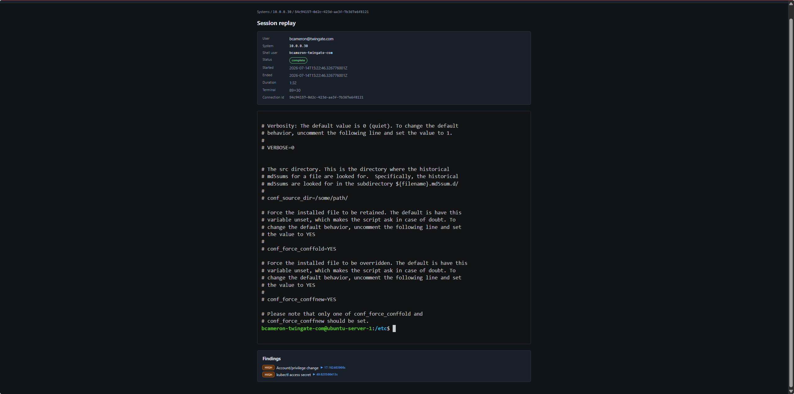
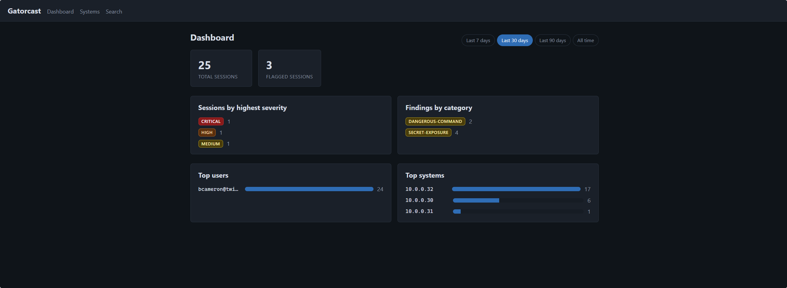
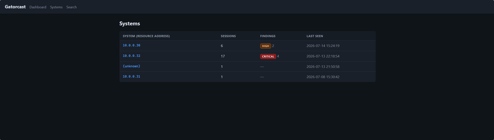
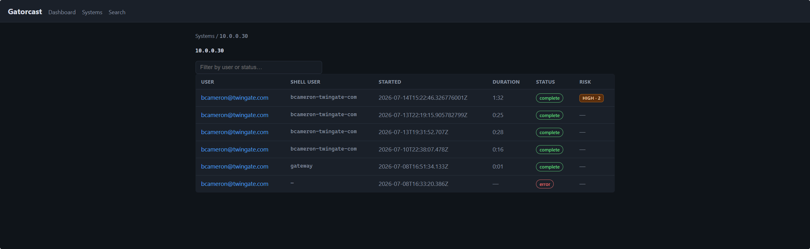
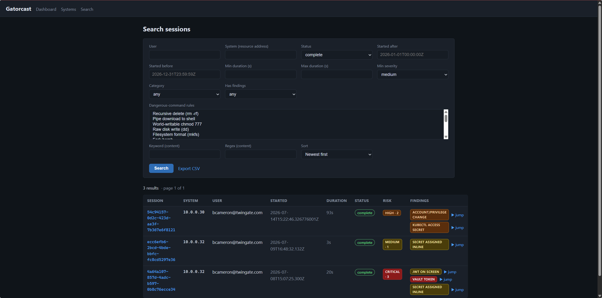
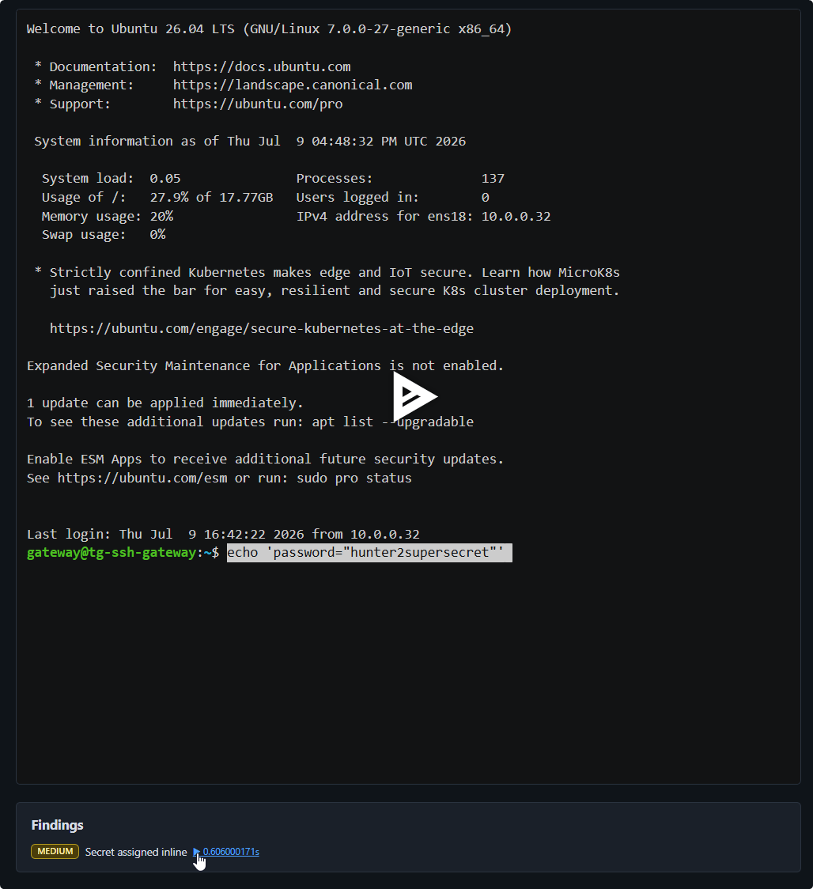

# Gatorcast

> **⚠️ Example project — provided as-is, with no support or warranty.** Gatorcast is published as a reference example to build from, not a supported product. Nothing here is guaranteed and no support is attached to it. It was developed with help from an LLM-based coding assistant. **Review the code and test it yourself before using it in any critical or production environment.** Your use is governed by the [Apache License 2.0](LICENSE), including its "AS IS", no-warranty (Section 7), and limitation-of-liability (Section 8) terms.

Self-hosted, single-container service for **Twingate Identity Firewall Gateway session recordings**. The Twingate Gateway records interactive privileged sessions (`kubectl exec`, SSH shells) as asciicast v2 fragments and emits them via structured JSON audit logs. Twingate's reference pipeline ships those fragments to object storage but does not reassemble them into sessions or provide a browse/replay UI. Gatorcast fills that gap: it receives the Gateway's log lines via push (HTTP POST or syslog TCP), demultiplexes concurrent sessions by `conn_id`, reassembles each into a complete asciicast v2 document, stores it, and serves a lightweight web UI to browse **systems → sessions → replay** in a locally vendored asciinema player. All recordings stay on your infrastructure.

Gatorcast also stores the Gateway's per-request Kubernetes API audit lines as allowlisted **kubectl activity** metadata (method, sanitized URL, status, user, and three request headers), grouped per user and cluster and shown next to the recordings. No recording or request body is ever involved. See [kubectl Activity](#kubectl-activity).



---

## A Quick Tour

**Dashboard** — session volume, flagged sessions, findings by severity and category, the most active users and systems, and a recent-activity feed. Every tile, severity chip and top user links into [search](#unified-search) with the selected time window:



**Systems → sessions** — recordings are grouped by target system (`resource_address`), with per-system findings badges; drill into a system to see every session with its user, duration, status, and risk:





**kubectl activity** — the systems list also includes clusters that only have kubectl API activity, with type badges and separate "Last session" and "Last API request" columns. A system page adds a per-user kubectl activity table, and each row opens a page of that activity session's commands, with findings and links to any exec recordings. The dashboard has a kubectl API requests card. See [kubectl Activity](#kubectl-activity).

**Search** — one timeline over SSH recordings, kubectl exec recordings, failed connections and kubectl commands. Filter by type, user, system, time, duration, status, finding severity/category or specific detection rules, plus full-content keyword/regex search over recordings. Recording results link straight to each finding's timestamp in the replay, kubectl commands expand to their requests, and any result set exports to CSV. See [Unified Search](#unified-search):



**Detection** — built-in dangerous-command and secret-exposure rules run live on every session; each finding jumps the player to the exact moment it happened:



---

## Documentation

This README covers install, configuration, and day-to-day operation. The deeper topics live in their own docs:

- **[ARCHITECTURE.md](ARCHITECTURE.md)** — how data flows through the service, the session lifecycle, encryption at rest, the security model, and retention.
- **[SEARCH_AND_DETECTION.md](SEARCH_AND_DETECTION.md)** — the dashboard, search/filtering, content-search internals, and the full built-in detection rule set.
- **[INGESTION_RECIPES.md](INGESTION_RECIPES.md)** — a cookbook for forwarding Gateway logs into Gatorcast from any deployment: systemd VMs, Terraform-provisioned cloud instances (AWS/GCP/Azure), Docker, and Kubernetes.
- **[TESTING.md](TESTING.md)** — running the test suite, seeding demo data, and the exact text to paste into a session to trigger each built-in detection rule (plus negative controls).

---

## Quickstart

**Prerequisites:** Docker and Docker Compose.

### 1. Get the files

```bash
git clone https://github.com/Twingate-Solutions/gatorcast.git
cd gatorcast
```

The `docker-compose.yml` pulls the image from GHCR — it never builds locally.

### 2. Create your `.env`

```bash
cp .env.example .env
```

Edit `.env` and set strong values for all three secrets:

```bash
INGEST_TOKEN=<long-random-string>    # Bearer token your shipper presents to /ingest
UI_AUTH_USERNAME=<your-username>     # Web UI login
UI_AUTH_PASSWORD=<strong-password>   # Web UI password
```

> **Important:** Gatorcast logs a warning at startup (`config.insecure_default`) if any of these values are still equal to the placeholder defaults (`change-me-long-random`, `admin`, `change-me`). The service will still start, but do not run it on a network with those defaults in place.

### 3. Start the service

```bash
docker compose pull
docker compose up -d
```

### 4. Browse the UI

Open `http://<your-host>:8080` in a browser. You will be prompted for the `UI_AUTH_USERNAME` and `UI_AUTH_PASSWORD` you set above.

Sessions appear as soon as the shipper begins forwarding Gateway logs — a recording shows up (in progress, and playable) on its first chunk and flips to complete when the Gateway sends its "session finished" flush. To forward logs in, see [INGESTION_RECIPES.md](INGESTION_RECIPES.md).

---

## Configuration

All settings are environment variables. Secrets (`INGEST_TOKEN`, `UI_AUTH_*`, `GATORCAST_MASTER_KEY`) should live in `.env` (which is in `.gitignore`).

The shipped `docker-compose.yml` already sets nine variables in its `environment:` block: `HTTP_PORT`, `SYSLOG_TCP_PORT`, `DATA_DIR`, `IDLE_TIMEOUT_SECONDS`, `SESSION_MAX_IDLE_SECONDS`, `RETENTION_DAYS`, `RETENTION_MAX_GB`, `LOG_LEVEL` and `ENCRYPTION_ENABLED`. Docker Compose gives `environment:` precedence over `env_file`, so change those nine in `docker-compose.yml`; the same names in `.env` are ignored. Every other variable can go in `.env`.

| Variable | Default | Meaning |
| --- | --- | --- |
| `HTTP_PORT` | `8080` | FastAPI HTTP port (UI + `POST /ingest`). The shipped compose file publishes `8080:8080`, so change that mapping too if you change this. |
| `SYSLOG_TCP_PORT` | `6514` | Syslog TCP listener port. `0` disables the listener. |
| `DATA_DIR` | `/data` | Volume root for the SQLite database (`gatorcast.db`), `.cast` files and search sidecars |
| `IDLE_TIMEOUT_SECONDS` | `120` | Sets how often the idle-backstop sweep runs (this value clamped to 5–30 seconds) and, on restart, the age past which a provisional row with no `.cast` is swept as an abandoned start. **Not** a finalize trigger (recordings seal on the Gateway's "session finished" flush). |
| `SESSION_MAX_IDLE_SECONDS` | `3600` | Idle backstop after this much silence: a recording **with data** is sealed (reopenable — a later chunk resumes it); a session that started but **never recorded** a valid chunk is marked `error`. **Must exceed the Gateway's flush interval** (a quiet-but-active session is chunkless until its first flush). Under encryption, also bounds how long a recording stays plaintext at rest. |
| `RETENTION_DAYS` | `90` | Purge sessions older than this many days. Also purges kubectl API requests (with their findings) and connections on the same cutoff. `0` keeps everything forever. See [Retention](#retention). |
| `RETENTION_MAX_GB` | `0` | Optional total recording (`.cast`) size cap in GB. When over the cap, the oldest completed sessions are deleted. `0` disables size-based purge. Counts recording bytes only; API rows and connections are never touched by it. |
| `LOG_LEVEL` | `info` | structlog level (`debug`, `info`, `warning`, `error`) |
| `INGEST_TOKEN` | `change-me-long-random` | Bearer token the shipper presents to `POST /ingest`. The default is a placeholder; set your own. |
| `UI_AUTH_USERNAME` | `admin` | Username for web UI HTTP Basic auth |
| `UI_AUTH_PASSWORD` | `change-me` | Password for web UI HTTP Basic auth. The default is a placeholder; set your own. |
| `ENCRYPTION_ENABLED` | `false` | Encrypt `.cast` recordings at rest (AES-256-GCM). Opt-in. Set it in `docker-compose.yml`, not `.env` (see above). See [Encryption at Rest](#encryption-at-rest). |
| `GATORCAST_MASTER_KEY` | *(unset)* | Base64 32-byte key (`openssl rand -base64 32`). **Required** when encryption is enabled; startup fails without a valid key. Also keys the search sidecars. |
| `DETECTION_ENABLED` | `true` | Master switch for detection: scans each recording live on every append and again at seal, and applies the kubectl API rules to each stored request. `false` produces no findings and skips the startup backfill. See [SEARCH_AND_DETECTION.md](SEARCH_AND_DETECTION.md). |
| `BACKFILL_ON_STARTUP` | `true` | On startup, index and scan completed recordings that lack a search sidecar. Has no effect when `DETECTION_ENABLED=false`. |
| `SEARCH_PAGE_SIZE` | `50` | Default number of search results per page. A `page_size` query parameter (1 to 200) overrides it. |
| `SEARCH_REGEX_MAX_CANDIDATES` | `2000` | Max sidecars read per page of a keyword/regex content search, and per CSV export (cost / ReDoS bound). When a page hits it, search offers **Continue scanning**. |
| `KUBECTL_ACTIVITY_GAP_SECONDS` | `900` | Inactivity gap that splits one user's kubectl activity on a cluster into separate activity sessions. Must be greater than `0`. |
| `KUBECTL_ACTIVITY_MAX_SECONDS` | `14400` | Hard cap on the span of one activity session. Bounds long-lived clients (`k9s`, `kubectl get -w`, CI polling) that never leave a gap. Must be greater than or equal to `KUBECTL_ACTIVITY_GAP_SECONDS`. |

`KUBECTL_ACTIVITY_GAP_SECONDS` and `KUBECTL_ACTIVITY_MAX_SECONDS` must satisfy `0 < gap <= max`. If they do not, the service refuses to start and the error names both values. Both are listed in `.env.example`.

---

## Ingestion

Gatorcast is push-only: it exposes two front doors and waits. Both feed the same pipeline, and the Gateway's log lines are the same on either.

| Door | Where | Auth |
| --- | --- | --- |
| HTTP | `POST /ingest` on `HTTP_PORT` | `Authorization: Bearer <INGEST_TOKEN>` |
| Syslog TCP | `SYSLOG_TCP_PORT` (`6514`) | None. Bind it to an internal interface only. |

**HTTP.** An `application/json` body is parsed as one document, either a single object or an array of objects. Any other content type (`application/x-ndjson`, `text/plain`) is read as newline-delimited, one JSON object per line. A line that cannot be parsed is dropped without failing the batch. The response is `204 No Content` even when some lines were dropped, and `401` when the token is missing or wrong. The app sets no body-size limit; set one at your proxy (see [Deployment Behind a Reverse Proxy](#deployment-behind-a-reverse-proxy)).

**Syslog TCP.** TCP only; UDP is never accepted, because asciicast lines are multi-KB and must not be truncated. Octet-counted (RFC 6587) and newline-delimited framing are both accepted and detected per message. A frame over 16 MiB closes the connection, at most 128 connections are served at once, and a connection idle for 5 minutes is closed.

**Both doors** strip a syslog `<PRI>` header and unwrap a Docker `{"log": "...", "stream": "..."}` envelope before parsing. After that, only three kinds of line are kept: recording chunks, `Authenticated connection` lines, and API request audits. Everything else is dropped by design.

For a copy-paste test and shipper recipes (journald, rsyslog, Vector, Docker, Kubernetes), see [INGESTION_RECIPES.md](INGESTION_RECIPES.md); the curl test is in §8.

---

## Web UI

Every page and the `.cast` stream require HTTP Basic auth (`UI_AUTH_USERNAME` / `UI_AUTH_PASSWORD`). Only `/healthz` and `/static/*` are open.

| Route | What it shows |
| --- | --- |
| `/` | Redirects to `/dashboard`. |
| `/dashboard` | Totals, severity and category breakdowns, top users and systems, the kubectl API requests card, and a recent-activity feed. `?window=7`, `30` (default), `90` or `all` sets the time window; an invalid value falls back to 30. See [Dashboard](#dashboard). |
| `/systems` | One row per target system, with SSH / Kubernetes type badges, session count and last session, kubectl request count and last API request, and a findings badge. Sessions with no target system appear as `(unknown)`. |
| `/systems/{slug}` | The system's recordings (newest first) and its kubectl activity table, with links into search for the system. `{slug}` is the URL-encoded `resource_address`, or `_unknown`. |
| `/systems/{slug}/activity` | One kubectl activity session. Takes `user`, `from` and `to`, plus optional `discovery=1`; the links on the system page fill these in. |
| `/sessions/{conn_id}` | Session metadata, the asciinema player, and the findings list. `?t=<seconds>` opens the player at that offset. The user links to their activity in search; an exec recording links to its kubectl command. |
| `/sessions/{conn_id}/cast` | The `.cast` bytes, consumed only by the player. Decrypted in memory for sealed recordings when encryption is on. |
| `/search`, `/search/export.csv` | One search over every event kind; CSV export of the current result set. See [Unified Search](#unified-search). |
| `/healthz` | Liveness probe. Returns `{"status": "ok"}` with no auth. |

Session status shows as **in progress** (still recording, playable now), **complete**, or **error** (the recording had no valid asciicast header when it sealed, or the connection never delivered a recording chunk or API audit before the backstop).

Recording content is never rendered as HTML. It is only ever loaded by the vendored asciinema player.

---

## Search and Detection

**Detection.** 21 built-in rules (14 dangerous-command, 7 secret-exposure) scan each recording live on every append and again when it seals. A finding stores the rule, severity, label and replay offset only, never the matched text. Rules are fixed in code; there is no rule configuration. Disable detection with `DETECTION_ENABLED=false`.

**Search.** `/search` is one search over every event kind. See [Unified Search](#unified-search) below.

The full rule list, filter reference and search internals are in [SEARCH_AND_DETECTION.md](SEARCH_AND_DETECTION.md).

---

## Unified Search

`/search` lists SSH recordings, kubectl exec recordings, failed connections and kubectl commands in one interleaved timeline. Each row carries a type badge. There is no result total, because a total would need every kubectl command grouped. Paging is forward-only: **Next ›** moves on, **First page** returns to the start, and the browser's Back button returns to earlier pages.

### Types

The `type` parameter (the form's Type select) chooses which kinds are searched.

| `type` | Lists |
| --- | --- |
| `any` (default) | Every kind below |
| `recordings` ("All sessions") | SSH recordings, kubectl exec recordings and failed connections. This is every row the dashboard's "Total sessions" counts. |
| `ssh` | SSH recordings |
| `exec` | kubectl exec/attach recordings |
| `failed` | Failed connections: a connection that delivered neither recording chunks nor API audits before `SESSION_MAX_IDLE_SECONDS`. These have no recording, so the row shows **Details ›** (the session metadata page) instead of **Replay**. |
| `kubectl` | kubectl commands |

A kubectl result is one **command**, grouped the same way as the activity page (by `Kubectl-Session`, else by connection, within one user and one cluster). Each row expands inline to its requests (the first 200, with a link to the activity view for the rest). A command appears in the window that contains its first request, and it always shows all of its requests.

Under `any`, a kubectl exec recording appears twice by design: as its own `exec` row, and as the **Replay** link inside its kubectl command row.

### Filters

| Parameter | Meaning |
| --- | --- |
| `type` | See above. |
| `system` | Exact `resource_address`. `_unknown` selects sessions with no system. |
| `user` | Exact match on the username or on the Gateway user id. Usernames across the UI link to `/search?user=<username>`, which is the per-user view: that user's SSH, exec and kubectl activity on every system. |
| `window`, `from`, `to` | `window` is `7`, `30`, `90` or `all` (days back from now). `from` and `to` are inclusive ISO 8601 times (naive means UTC). Do not combine `window` with `from` or `to`. |
| `severity`, `max_severity` | At-or-above, or exact highest severity. |
| `has_findings`, `category`, `rule_ids` | Finding filters. They apply to recording findings and to kubectl API findings (`category=kube-api`, `kube-*` rule ids). |
| `status`, `min_duration`, `max_duration` | Recordings only. |
| `q`, `mode` | Text (default) or regex. Text matches recording content case-insensitively, and matches a kubectl command's URL paths (query strings excluded) and `Kubectl-Command` values. Regex runs over recordings only. |
| `sort` | `newest` (default), `risk`, or `duration` (recordings only). |
| `discovery` | `1` shows discovery-only kubectl commands, which are hidden by default. |
| `cmd` | A request id. Shows the one kubectl command that request belongs to, expanded, and ignores the other filters (except `discovery`). An unknown id shows "Command not found". Linked from an exec recording's session page and from the dashboard feed. |
| `page_size`, `cursor` | Page size (1 to 200) and the opaque position that **Next ›** carries. |

**A filter a kind cannot evaluate excludes that kind.** The page shows a notice, for example "kubectl commands not searched: the Status filter applies to recordings only." `status`, `min_duration`, `max_duration`, `mode=regex` and `sort=duration` exclude kubectl commands; `cmd` excludes recordings. A kind that can evaluate the filter but has no match simply returns no rows.

**Invalid input is a `400`.** An unknown `sort`, a non-numeric duration, a repeated parameter, `window` combined with `from`, `from` later than `to`, an uncompilable regex and a bad `cursor` are all rejected with a message that names the parameter. Search forms swap the message into the results area.

### Old `/search` links

The earlier parameter names still work: `username`, `resource_address`, `started_after`, `started_before`, `keyword`, `regex` and `page`. The UI now builds only the new names.

**Old `/search` links can show more results, never fewer.** A link with no `type` now means `any`, so it lists every recording it listed before, plus any kubectl commands and failed connections that satisfy the same filters. A `username=` link also matches the Gateway user id. A link that carries a recordings-only filter (`status`, a duration, `regex`) still lists recordings only.

Three exceptions to that guarantee:

1. **Values that used to be ignored now fail.** An unknown `sort`, a non-numeric `min_duration` and an uncompilable `regex` used to be silently dropped. They now return `400`.
2. **`page=N` lands on the first page.** The same results are reachable with **Next ›**.
3. **Fractional-second bounds can differ at one boundary second.** A hand-typed `started_after` or `started_before` with a fractional second is now compared in a normalized format. Links generated by the dashboard never carried fractions.

### Paging and budgets

Each page costs in proportion to its size, not its depth. Three limits bound the work for one page. The scan and flagged limits are fixed in code; the sidecar limit is the `SEARCH_REGEX_MAX_CANDIDATES` setting:

- **kubectl commands:** at most 20,000 API request rows are examined per page. A search that matches rarely (for example a text search on a busy cluster) can stop early with a short page and the notice "Scanned 20,000 kubectl requests without filling the page."
- **Recording content search:** at most `SEARCH_REGEX_MAX_CANDIDATES` sidecars are read per page.
- **Flagged commands:** at most 5,000 flagged commands are considered per query. Past that the page says so and asks you to narrow by system, user or time.

When a budget stops a page, **Continue scanning ›** replaces **Next ›** and resumes without skipping or repeating results. A short or empty page with **Continue scanning ›** does not mean the search is finished.

### CSV export

**Export CSV** (`/search/export.csv`) follows the page: the same filters and kinds, one row per recording or kubectl command, mixed. It ignores `cursor` and `page_size` and writes up to 10,000 rows. The response header `X-Gatorcast-Truncated: true` is set when the export stopped early (row cap, a scan budget, the sidecar limit, or the flagged-command cap).

There are 15 columns. The first ten are unchanged for recordings: `conn_id`, `username`, `resource_address`, `status`, `started_at`, `ended_at`, `duration_seconds`, `finding_count`, `max_severity`, `findings`. The last five are new: `kind` (`ssh`, `exec`, `failed` or `kubectl`), `command`, `method`, `path` and `request_count`. kubectl rows fill the last five; `path` has no query string and `command` is the kubectl command label, never the full `User-Agent`. A text cell starting with `=`, `+`, `-`, `@`, tab or carriage return is written with a leading `'` so a spreadsheet does not treat it as a formula. The export never contains recorded text.

### Dashboard

The dashboard's figures link into search with an explicit `type` and the selected window, so a figure and its list agree:

| Dashboard element | Opens |
| --- | --- |
| Total sessions | `type=recordings` |
| Flagged sessions, session severity chips, category chips | `type=recordings` with `has_findings=true`, `max_severity=` or `category=` |
| kubectl API requests | `type=kubectl` |
| Flagged commands, API severity chips | `type=kubectl` with `has_findings=true` or `max_severity=` |
| Top users | `user=<username>` |
| Top systems | The system page |
| Recent activity | The newest 15 items of every kind (discovery-only commands hidden, not windowed). Rows open the replay, the session page, or `cmd=`. |

The kubectl card counts **commands** for its flagged figure and severity chips, and **requests** for its total (discovery included), so the total is the one figure that is not the length of its list. Two other figures differ from their lists by design: category chips count findings while the list shows sessions, and top users count sessions while the user link also lists kubectl commands. If more than 5,000 flagged commands match, the flagged figures are lower bounds and show as `5000+`.

Session figures are windowed on the recording start (the Gateway start time, else the time Gatorcast first saw the session), the same rule search uses.

---

## kubectl Activity

Besides recordings, the stock Gateway emits one `gateway.audit` line per Kubernetes API request (`"API request completed"` or `"API request failed"`). Gatorcast stores these as allowlisted metadata and shows them per user and cluster. It uses the same ingest paths (`POST /ingest`, syslog TCP) as recordings, so no extra shipper configuration is needed.

### How activity is grouped

- **API-only connections are not sessions.** An `Authenticated connection` line creates a hidden *pending connection*. A connection that only makes API requests never appears as a recording session. A connection that delivers neither recording chunks nor API audits within `SESSION_MAX_IDLE_SECONDS` becomes a visible `error` session.
- **Activity sessions.** Requests are grouped by user and cluster, then split when the gap since the previous request exceeds `KUBECTL_ACTIVITY_GAP_SECONDS`, or when one session's span reaches `KUBECTL_ACTIVITY_MAX_SECONDS`. Grouping is computed when a page is viewed. Nothing is cached.
- **Commands.** Within an activity session, requests are grouped into commands by the `Kubectl-Session` header (one UUID per `kubectl` run). A request with no `Kubectl-Session` is grouped by its connection instead. API-discovery `GET`s (`/api`, `/apis/…`, `/openapi/…`, `/version`) count toward timing but are hidden by default; the activity page has a toggle to show them.
- **Exec recordings.** An exec/attach recording links to its command by `request_id`, never by connection, because one `kubectl exec` can use two connections. The activity page links each command to its recording; recordings still replay on the normal session page.

### Where it appears in the UI

| Page | What it shows |
| --- | --- |
| `/systems` | Systems with recordings **and** clusters that only have kubectl activity. A **Type** column badges each system SSH and/or Kubernetes (a start-only `error` row earns neither). **Last session** and **Last API request** are separate columns, and rows sort by the newer of the two. The session and API request counts link into search. The Findings column counts recording findings only. |
| `/systems/{slug}` | The system's recordings, plus a **kubectl activity** table of per-user activity sessions. It shows 7 days at a time; use the "Older" and "Latest" links to page. At most 20,000 requests are read per page, and a notice appears if the cap is hit. "Search this system" and "kubectl commands in search" link into search, and each username has a trailing ⌕ link to that user's activity. |
| `/systems/{slug}/activity` | One activity session: its commands, each command's requests and findings, and links to exec recordings. No player is used. The user in the header links to search. |
| `/dashboard` | A **kubectl API requests** card: total requests, flagged commands, and a severity breakdown of those commands, within the selected time window. Each figure links to search. |
| `/search` | kubectl commands, one row per command, expandable to their requests, mixed with recordings. See [Unified Search](#unified-search). |

kubectl commands are searchable and included in the CSV export. Individual requests are not search rows: they appear only inside their command.

### API findings

Each stored request is checked against built-in rules on its method and normalized path. A finding stores the rule, category (`kube-api`), severity and label only, never the URL. Findings show on the activity page and in search, and feed the dashboard card. They are not produced when `DETECTION_ENABLED=false`.

| Rule | Severity | Matches |
| --- | --- | --- |
| `kube-delete` | high | Any `DELETE` request |
| `kube-secrets` | high | Any request to a `…/secrets` path |
| `kube-evict` | high | `POST …/pods/<name>/eviction` (drain) |
| `kube-cordon` | medium | `PATCH /api/v1/nodes/<name>` (cordon/uncordon) |
| `kube-exec` | medium | `…/pods/<name>/exec` or `…/attach` |
| `kube-node-proxy-exec` | high | `…/nodes/<name>/proxy/exec`, `run` or `attach` (kubelet exec through the API server) |

Rules match on the normalized path, so encoded or oddly shaped variants (`%73ecrets`, a trailing `/`, doubled `//`) still match. Query strings are never matched.

### What is stored, and what is never stored

Stored per request: `request_id`, `conn_id`, cluster (`resource_address`), user id and username, `requested_at`, method, a sanitized URL, status code, outcome (`completed` or `failed`), and these three request headers only:

- `User-Agent`
- `Kubectl-Command`
- `Kubectl-Session`

Header names are matched case-insensitively. Only the first value is kept, capped at 256 characters.

**Never stored, and never logged:** `Authorization` (present on every request), cookies, every other request header, all response headers, `remote_addr`, and panic content. Raw audit lines are never logged.

**URLs are normalized before storage:**

- The fragment is dropped. The path is percent-decoded once, repeated `/` are collapsed, and a trailing `/` is removed.
- If the decoded path contains an encoded `?` or `#` (`%3F`, `%23`), the path is cut at that character and the whole query is dropped. If the path is still percent-encoded after one decode, the query is dropped as ambiguous.
- Only allowlisted query keys are kept, and a key with a rejected value is dropped. Every other key is dropped outright, not kept blank. The allowlist is `labelSelector`, `fieldSelector`, `limit`, `continue`, `watch`, `timeout`, `timeoutSeconds`, `resourceVersion`, `resourceVersionMatch`, `allowWatchBookmarks`, `propagationPolicy`, `gracePeriodSeconds`, `dryRun`, `fieldManager`, `fieldValidation`, `force`, `follow`, `tailLines`, `sinceSeconds`, `previous`, `timestamps`, `pretty` and `orphanDependents`. Values must be at most 256 characters with no `;` and no control characters.
- **Exec/attach** URLs (`…/pods/<name>/exec` and `…/attach`) additionally keep only `container`, `stdin`, `stdout`, `stderr` and `tty`. Flags must be `true`, `false`, `1` or `0`, and `container` must be a valid DNS-label-style name. `command=` and every other parameter is always dropped, because it can hold secrets.
- Anything after a `/proxy` segment is dropped, along with the whole query, because the rest of the URL is forwarded to a backend. The one exception is `/nodes/<name>/proxy/exec`, `run` or `attach`, where that single segment is kept so `kube-node-proxy-exec` can still fire.

A request and its findings are written in one transaction, so a redelivered line never produces duplicate or partial rows. API rows are deduplicated by `request_id`.

Activity data is purged on the same cutoff as sessions. See [Retention](#retention).

---

## Encryption at Rest

Opt-in. When enabled, `.cast` recordings are encrypted on the volume with AES-256-GCM, using a key derived from `GATORCAST_MASTER_KEY`. The search sidecars (`<conn_id>.txt.enc`) are encrypted under an independent key derived from the same master key. Sealed recordings are decrypted in memory for playback.

To enable it:

1. Generate a key: `openssl rand -base64 32`
2. Put `GATORCAST_MASTER_KEY=<that value>` in `.env`.
3. In `docker-compose.yml`, change `ENCRYPTION_ENABLED: "false"` to `"true"`. A value in `.env` does not override it.
4. Run `docker compose up -d`.

If encryption is enabled and the key is missing or invalid, the service refuses to start.

Limits to know before you rely on it:

- **In-progress recordings are plaintext on disk** until they seal. Lower `SESSION_MAX_IDLE_SECONDS` to shorten that window for abandoned sessions.
- **The metadata database is not encrypted** (usernames, system addresses, finding labels).
- **Fresh-start only.** Enabling it does not encrypt existing recordings.
- **Losing the key loses the recordings.** There is no key rotation.

Details: [ARCHITECTURE.md](ARCHITECTURE.md#encryption-at-rest).

---

## Retention

A purge runs every 24 hours with two independent policies:

- **Age (`RETENTION_DAYS`, default 90).** Deletes sessions whose start time is older than the cutoff, along with their `.cast` file, search sidecar and findings. Sessions with no start time are not age-purged. The same cutoff deletes kubectl `api_requests` (with their findings) and `connections`. An API request is purged when either its Gateway timestamp or the time Gatorcast stored it is older than the cutoff, so a forged future timestamp cannot keep a row forever. Connections are purged on Gatorcast's own timestamps only. There is no separate setting for API activity.
- **Size (`RETENTION_MAX_GB`, default off).** When total recording size is over the cap, deletes the oldest completed sessions until it is under. It counts recording bytes only and never deletes API rows or connections.

`0` disables a policy. To keep everything, set `RETENTION_DAYS=0` and leave `RETENTION_MAX_GB=0`. See [ARCHITECTURE.md](ARCHITECTURE.md#retention).

---

## Deployment Behind a Reverse Proxy

The intended production layout is Gatorcast behind **NPMplus + CrowdSec** (or any reverse proxy):

- The proxy terminates TLS and forwards HTTP traffic to Gatorcast on port `8080`.
- The syslog TCP port (`6514`) is **not** published through the proxy; it is for direct internal access only.

**Body-size limit at the proxy:** Gatorcast's `/ingest` endpoint intentionally accepts large request bodies (asciicast lines are multi-KB; a batch of many lines can be several MB). Configure a generous but bounded `client_max_body_size` (or equivalent) at the proxy level — for example, `64m` or `128m` — to cap potential abuse while allowing legitimate batched payloads. Do not set a tight limit (e.g. 1m) that would truncate real batches.

**Syslog TCP interface binding:** In `docker-compose.yml` the syslog port is bound to loopback by default:

```yaml
ports:
  - "127.0.0.1:6514:6514"   # syslog TCP (internal interface only)
```

If your shipper runs on a different host, change `127.0.0.1` to the host's internal/VPN interface IP so only authorized shippers on that network can reach it. Never bind it to `0.0.0.0` in a production environment.

---

## Updating

Gatorcast uses a floating `latest` tag in docker-compose. To update:

```bash
docker compose pull
docker compose up -d
```

The `gatorcast-data` named volume (SQLite database + `.cast` files) persists across container replacements. Schema changes are applied automatically on start; there is no manual migration step.

### Upgrading to the kubectl activity release

**Back up the `/data` volume before upgrading** (see [Where is my data?](#where-is-my-data)). On first start the service runs a one-time database migration (`PRAGMA user_version` 0 to 1). Once applied, it never runs again. There is no down-migration: to roll back, restore your backup.

The migration removes historical *start-only* session rows from the sessions list. These are rows that never received a recording chunk: `provisional` or `error` status, zero chunks, no `.cast` path, and zero bytes. Before this release, every `Authenticated connection` line created a visible session, so API-only kubectl connections and SSH transport failures showed up as empty `provisional` or `error` sessions. Those rows are moved into the hidden `connections` table. Old SSH transport-failure rows cannot be told apart from API-only rows, so they are moved too. **This is expected.** Session counts on the dashboard and systems list can drop after the upgrade.

A row is **kept** if a `<conn_id>.cast` file or `<conn_id>.txt.enc` sidecar exists for it on disk, even when its metadata looks empty. Such a row stays in the sessions list, is re-adopted at startup, and is purged by retention as normal.

The migration only covers sessions. Past API requests were not stored before this release, so kubectl activity starts from the upgrade.

### Upgrading to 0.4.0 (unified search)

There is no manual step and no `PRAGMA user_version` change. On first start the service:

- builds four new indexes (three on `api_requests`, one on `sessions`). On a large `api_requests` table the first boot takes longer while they build.
- adds a `sessions.sealed_terminal` column. Sessions sealed before the upgrade have no value there and are treated as terminally sealed, so a late chunk never overwrites them.

Back up the `/data` volume first, as for any upgrade. Old `/search` links keep working; see [Old `/search` links](#old-search-links) for the exceptions.

To pin to a specific version, change the image tag in `docker-compose.yml`:

```yaml
image: ghcr.io/twingate-solutions/gatorcast:v0.4.0
```

---

## Troubleshooting

### Container exits at startup

Check `docker compose logs gatorcast`. Two configurations stop the service on purpose:

- `ENCRYPTION_ENABLED=true` with `GATORCAST_MASTER_KEY` missing or not a base64 32-byte value. It refuses to boot rather than store recordings in the clear. Generate a key with `openssl rand -base64 32`.
- `KUBECTL_ACTIVITY_GAP_SECONDS` and `KUBECTL_ACTIVITY_MAX_SECONDS` not satisfying `0 < gap <= max`. The error names both values.

### Sessions stuck in "provisional" (in-progress) status

A recording is provisional (shown as "in progress") while it is still recording; its `.cast` is on disk and playable throughout. It seals to complete when the Gateway sends its final flush (`message == "session finished"`), or — as a backstop — after `SESSION_MAX_IDLE_SECONDS` of silence. If sessions remain provisional indefinitely:

- Verify your shipper is forwarding log lines during active sessions (check rsyslog/Docker syslog driver stats). A recording that is provisional but *playable* just hasn't received its "session finished" flush yet.
- Confirm the Gateway actually ends the session (its recorder emits "session finished" on `Stop()`). If the shipper drops that line, the recording seals via the backstop after `SESSION_MAX_IDLE_SECONDS`; lower that value to seal sooner, or raise it if you hold sessions idle for very long.
- **Connected but no recording?** A connection that authenticated but never delivered a recording chunk or an API audit (e.g. its chunks were all dropped — see the big/chatty-session note below) is a hidden pending connection, not an "in progress" session. At the `SESSION_MAX_IDLE_SECONDS` backstop it becomes a visible `error` session. A connection that only makes API requests never becomes a session; its requests appear under kubectl activity. Watch for `event=normalize.drop reason=unparseable length=…` in the logs — a `length` at/near 49152 means the transport is splitting your chunks (journald `LineMax`). If a real recording does arrive late, the errored row automatically recovers.
- On restart, Gatorcast re-adopts provisional rows that have an on-disk `.cast` as in-progress (continuation chunks keep appending); a provisional row with no `.cast` older than `IDLE_TIMEOUT_SECONDS` is an abandoned start and is removed.

### Big or "chatty" sessions not recording (`btop`, `top`, `watch`, verbose output)

If ordinary sessions record fine but a session that ran a **full-screen TUI or produced a firehose of output** stays "in progress" with no recording, the culprit is almost always your **log transport**, not Gatorcast — most commonly **systemd-journald limits** when shipping via journald (INGESTION_RECIPES.md §2.1):

- **`LineMax` (default 48 KB):** journald splits any log line longer than this, so a large asciicast chunk arrives as unparseable fragments and is dropped (`event=normalize.drop reason=unparseable`). The recording never assembles.
- **Rate limiting:** a rapidly repainting TUI can exceed journald's `RateLimitBurst`, so entries are dropped outright (`Suppressed N messages`), leaving gaps.

Quick fixes: raise `LineMax` (e.g. `LineMax=4M`) and relax rate limiting (`RateLimitBurst=0`) in `/etc/systemd/journald.conf`, then restart `systemd-journald` **and** your shipper. For recording TUIs routinely, prefer the **file-tail transport (§2.4)** — it has neither limit. Full detail and a diagnosis command are in [INGESTION_RECIPES.md](INGESTION_RECIPES.md) §2.1. (UDP syslog has the same truncation problem — always ship over TCP or HTTP.)

### Nothing showing up in the UI

1. **Check `INGEST_TOKEN`:** Send a test `curl` request (see [INGESTION_RECIPES.md](INGESTION_RECIPES.md) §8). A 401 response means the token does not match.
2. **Two-stage recording filter:** A line is a recording chunk only when `logger == "gateway.audit"` AND the `asciicast` field is non-null. `gateway.audit` lines without an `asciicast` field and with the message `API request completed` or `API request failed` are stored as kubectl activity metadata, not recordings. They appear under the system's kubectl activity table and as kubectl commands in search (`type=kubectl`), not in its session list. Other `gateway.audit` messages are dropped by design.
3. **Check the shipper connection:** For syslog TCP, confirm the shipper's IP/port settings match the binding. For HTTP, check that the shipper sends a valid `Authorization: Bearer` header and a body of one JSON object per line (any content type other than `application/json` is read that way), or a JSON object/array with `Content-Type: application/json`.
4. **Session-start event:** The UI groups sessions by target system (`resource_address`). If the Gateway does not emit an `"Authenticated connection"` line for a session, the session will appear in an "unknown" bucket.
5. **kubectl activity missing for a cluster:** API audit lines carry no `resource_address`. The cluster is joined from the `"Authenticated connection"` line by `conn_id`, so that line must reach Gatorcast too. Requests whose connection start was never seen appear under the "unknown" system.

### Syslog framing issues

Gatorcast supports both RFC 6587 octet-counting (`<length> <msg>`) and newline-delimited framing, auto-detected per message. If you see log lines arriving garbled:

- Ensure your shipper is configured for TCP (not UDP). UDP will truncate multi-KB asciicast lines.
- The Docker syslog driver uses octet-counting by default with TCP; no extra configuration is needed.
- rsyslog `omfwd` over TCP can be configured with `TCP_Framing="octet-counted"` in the output action.

### Where is my data?

All data lives in the `gatorcast-data` named Docker volume, mounted at `/data` inside the container:

- SQLite database: `/data/gatorcast.db` (sessions, connections, findings, and kubectl API request metadata)
- Recording files: `/data/casts/<conn_id>.cast`
- Search sidecars: `/data/casts/<conn_id>.txt.enc`

Back up the whole volume, not just one file: the database and the `.cast` files belong together, and the database runs in WAL mode. Stop the container first (`docker compose stop`) for a consistent copy. Back up before every upgrade.

To inspect or back up:

```bash
# List volume location on the host. The prefix is your compose project name
# (normally the directory name); `docker volume ls` shows the exact name.
docker volume inspect gatorcast_gatorcast-data

# Open a shell to browse
docker run --rm -it -v gatorcast_gatorcast-data:/data alpine sh
```

---

## Offline Note

All frontend assets are vendored locally under `src/gatorcast/web/static/`:

- asciinema-player 3.8.0 (Apache-2.0 / MIT)
- htmx 2.0.4 (0BSD)
- Alpine.js 3.14.8 (MIT)

Gatorcast makes zero external network requests at runtime. There are no CDN dependencies, no web fonts loaded from external origins, and no external JavaScript. It operates fully air-gapped once the image is pulled.

---

## Out of Scope (v1)

The following are explicitly out of scope for this release and will not be added without a design discussion:

- Auto-following (live-tailing) replay of an in-progress session — in-progress recordings **are** playable, but the player shows a snapshot; reload to see output appended since. True streaming/auto-append is out of scope.
- Per-request search rows for kubectl activity — search returns commands, and requests appear only inside their command
- A stored command rollup, result totals, and a "previous page" link in search
- Alert dispatch (email/webhook/Slack) for findings — detection runs live (on every append) and findings are surfaced immediately, but push/alert delivery is a later consumer
- SSO or multi-user RBAC (the current auth is single-operator HTTP Basic)
- Encryption key rotation, and encryption of the metadata database
- Object-storage offload for cold recordings
- SSH/VM gateway journald tailing (Gatorcast is push-only)

---

## License

Gatorcast is licensed under the [Apache License 2.0](LICENSE). It is provided on an "AS IS" basis, without warranties or conditions of any kind — see the disclaimer at the top of this README and Sections 7 and 8 of the license.
